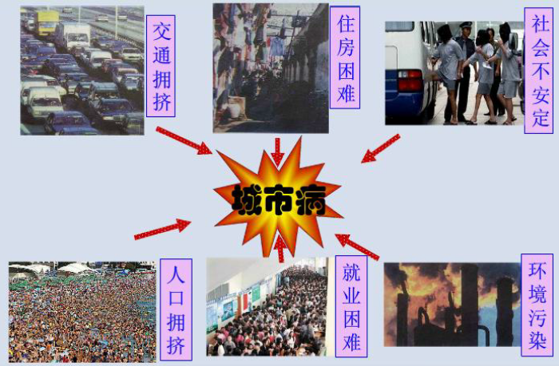
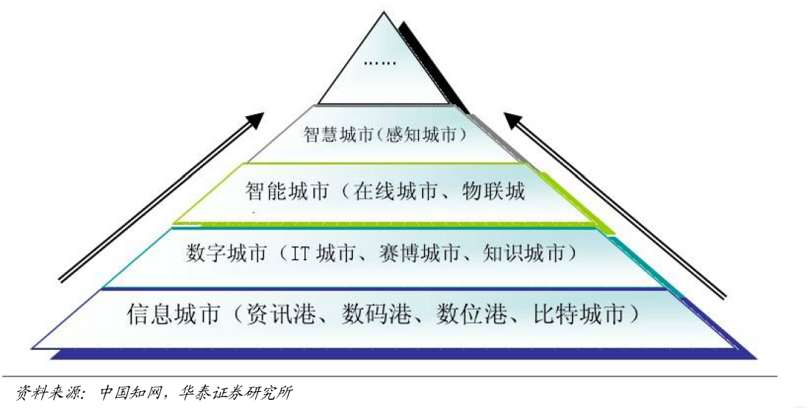
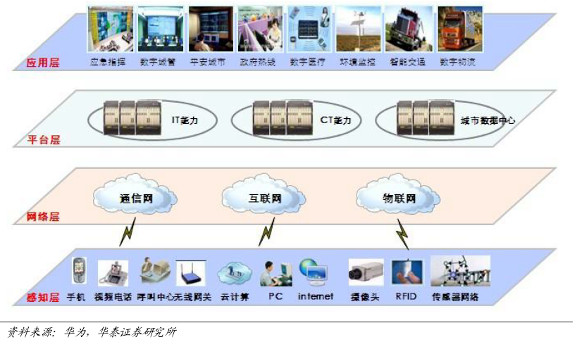
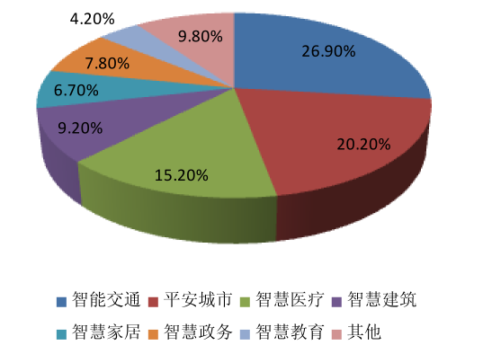
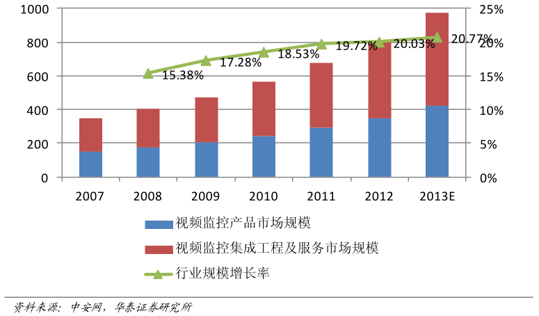
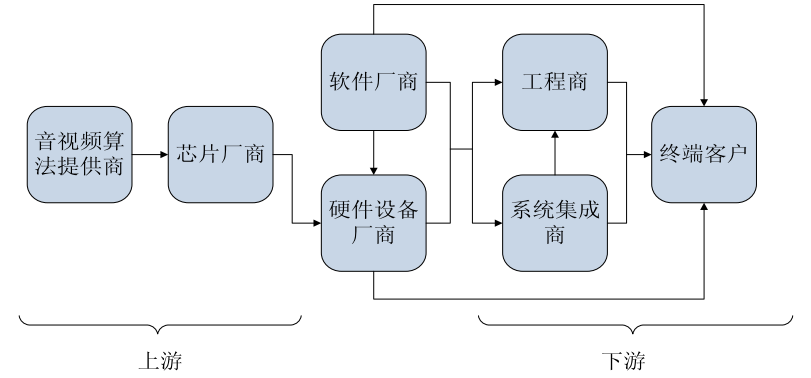
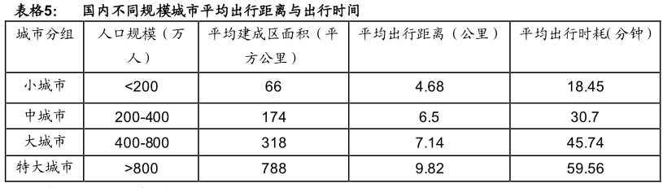

--- #title x:0 y:0 scale:2
2014年福建分公司
# 经纪业务工作报告*
^*陈红

--- #intro01 x:500 y:0 z:500 rotx:90
<h2 style="font-size:80px;position:center">城市</h2>

--- #intro02 x:500 y:500 z:500 rotx:90 roty:90
<b>
现实
</b>

--- #intro03 x:500 y:1500 z:500 rotx:90

--- #intro04 x:500 y:2500 z:500 rotx:90

--- #intro05 x:500 y:2500 z:1500 rotx:90
<h2 style="font-size:80px;position:center">城市「病」</h2>

--- #intro06 x:1000 y:500 z:1000 rotx:90
<h2 style="font-size:80px;position:center">智慧城市</h2>

---#intro07 x:1000 y:1000 z:1000 rotx:90 roty:90
## IBM
运用信息和通信技术手段感测、分析、整合城市运行核心系统的各项关键信息，从而对包括民生、环保、公共安全、城市服务、工商业活动在内的各种需求做出智能响应。

---#intro08 x:1000 y:1500 z:1000 rotx:90 roty:180
## 上海世博
城市，让生活更美好

---#intro09 x:1000 y:2000 z:1000 rotx:90 roty:90
## 八部门
经国务院同意，发改委、工信部、科技部、公安部、财政部、国土部、住建部、交通部等八部委29日印发《关于促进智慧城市健康发展的指导意见》。

--- #intro10 x:1000 y:3000 z:1500  rotx:90 

--- #intro11 x:1000 y:3500 z:1500  rotx:90 roty:90

---.slide #intro12 x:1000 y:4000 z:1500 rotx:90 roty:180
## 发展契机
### 提高城镇化质量治疗“城市病” 
#### 新型城市化发展模式

### 聚集新兴产业转变发展方式 
#### 工业化 ==> 自动化 ==> 信息化化 ==> 智能化

### 均化公共服务改善民生保障 
#### “治大国若烹小鲜”

--- #intro13 x:1500 y:-500 z:-500 rotx:90
<h2 style="font-size:80px;position:center">智慧城市全景设计</h2>

--- #intro14 x:1500 y:-1000 z:-500 roty:90 rotx:90

 
---------------------------------------------------------------

--- #intro15 x:2500 y:1000 z:500 rotx:90
<h2 style="font-size:80px;position:center">资本市场</h2>

--- #intro16 x:2500 y:1500 z:500 rotx:90 roty:180

--- #intro17 x:2500 y:2000 z:500 rotx:90 roty:90

--- #intro18 x:3000 y:2500 z:500 rotx:90
<h2 style="font-size:80px;position:center">平安城市</h2>

--- #intro20 x:3000 y:3000 z:500 rotx:90 roty:90

--- #intro21 x:3000 y:3500 z:500 rotx:90 roty:180

--- #intro21-1 x:3000 y:4500 z:500 rotx:90 roty:270

---.slide #intro22 x:3000 y:5000 z:500 rotx:90 
## 行业增长动力充足
### 下游强劲的需求拉动

- 《安防产业“十二五”规划》: 到“十二五”末期，安防产业规模将翻一番
- 年均增长率达到20%左右，2015年总产值达到5000 亿元
- 公共安全(校园安全)

### 新技术满足新需求，推动行业稳步增长 

- 信息共享
- 智能分析技术 
- 多点视频监控信息的融合 
- 图像增强技术 
- 海量数据处理技术 

--- #intro23 x:3500 y:500 z:500 rotx:90
<h2 style="font-size:80px;position:center">智能交通</h2>
 

--- #intro24 x:3500 y:1000 z:500 rotx:90 roty:180

--- #intro26 x:3500 y:2000 z:500 rotx:90 roty:90

--- #intro28 x:4500 y:500 z:500 rotx:90
<h2 style="font-size:80px;position:center">智慧医疗</h2>

--- #intro29 x:4500 y:1000 z:500 rotx:90 roty:90

  

--- #intro30 x:4500 y:1500 z:500 rotx:90 roty:180

--- #stock0 x:-1000 y:500 z:500 
<h2 style="font-size:80px;position:center">相关概念股</h2>

---.slide #stock2 x:-1000 y:1500 z:500 rotx:90 roty:180
### 服务器开发商:银江股份(300020)
#### 智能交通是核心业务:毛利率 50%
#### 智慧医疗正在起步：信息化平台
#### 公司定向增发进一步拓展业务领域
#### 瞄准智慧城市，潜力巨大

